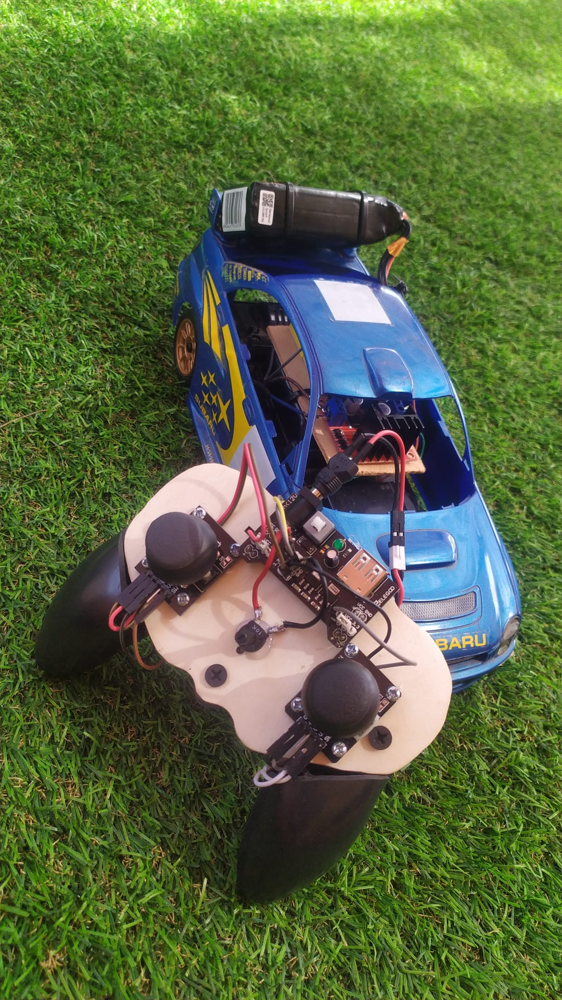

# DeltaCar: Proyecto real de módulo de conducción autónoma para seguimiento de carril [WIP]

Proyecto de máster cuyo objetivo persigue cumplir las siguientes especificaciones:

* Puesta a punto de la plataforma móvil: chasis de vehículo RC.
* Integración y configuración a bajo nivel del firmware de los componentes electrónicos a bordo.
* Desarrollo software de módulo de conducción autónoma para seguimiento de carril.

## Componentes Principales

- Chasis de coche estilo deportivo
- x2 Placas Wemos D1 Mini ESP8266 (receptor y emisor)
- Joysticks, potenciometros e interruptores
- Reguladores de tensión
- Baterías Li-Po para coche y mando
- Convertidores analógico-digital lectura joysticks
- Driver de motores para dirección y tracción
- LDR detección luminosidad
- LEDS luces delanteras para faros

## Funcionalidades Primarias

Under construction...

## Funcionalidades Secundarias

- **Avance y Retroceso**
- **Giros a la Derecha e Izquierda**
- **Control de Velocidad**
- **Función de Emergencia:** Parada en caso de pérdida de comunicación WiFi
- **Bocina:** Es posible hacer sonar un claxon
- **Luces Automáticas:** Cuenta con una ristra de leds que se encienden al detectar poca luz, por debajo de un cierto umbral. También es posible encenderlos de forma manual.

## Créditos

Proyecto derivado de la base del repositorio del investigador RPI en la Universidad de Sevilla, Álvaro García Lora, integrante del grupo de desarrollo y colaborador de este mismo proyecto:

[aglora/acker-car: Coche RC + Mando con WiFi (github.com)](https://github.com/aglora/acker-car)
